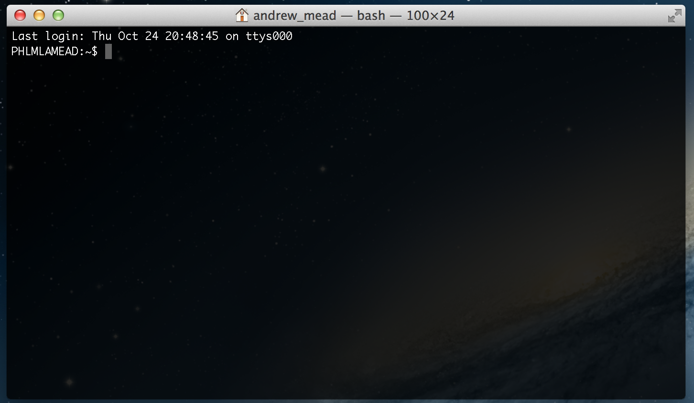
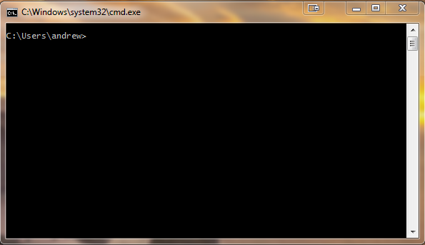

#Chapter One - Overview of Command Line Tools

Feel free to skip or skim this chapter if you're comfortable navigating and running commands from the command line. This introductory tour of the command line will get everyone up to speed with the command line, its syntax, and command line navigation.

##What is the command line?

The command line is a text-based interface for running applications on your computer. It doesn't have any fancy GUIs and is a mouse-free area. It lets you access your computer at a basic level.

In the command line, you issue commands for your computer to run. It will display a prompt asking you for instructions. You type in the command you would like to run and your computer tries to run it. Once your command has run, the command line will display another prompt asking for the next command.

You can do anything from the command line. Anything you can't do, you can build. The best part about the command line is that it has never been easier to create complex and powerful command line tools.

**important** - Your computer will try to run any command you give it. While some distructive commands may require certian privliges, others do not. Be safe while using the terminal.

##Accessing the command line

Depending on your operating system, the command line may be called something slightly different. In OS X it's called "terminal". In Windows it's called "command prompt". These both refer the to operating systems version of the command prompt.

**note** - For brevities sake, I will refer to the command prompt as the terminal regardless of the operating system.

**Opening Terminal in OS X** - If you are on a Mac, you can open the terminal by navigating to `Application/Utilities` and selecting `Terminal`. This will launch a terminal, presenting you with a screen that will look something like this.

**Opening the command prompt in Windows** - You can open the terminal in Windows by navigating to `C:\Windows\System32` and executing `cmd.exe`. You can also press `windows key + r`, type in `cmd`, and click enter. You should now see a window similar to this.

Every operating system has something similar. In Ubuntu, you can search for "terminal" to find its terminal. Other linux distributions have something similar.

##The prompt

Just like I promised, you are now in front of a black, text-based, computer program. The terminal has several different parts and understanding the vocabulary will go a long way to successfully creating your own tools.

First is the `prompt`. When your computer is ready for you to give it a command, it will displa a `prompt`. The prompt will look something like this:

	PHLMLAMEAD:~/code$ _

The first thing on this line is my username. Next is a colon which serves as a seperator. Following that is something called the `current working directory`. Whenever you are in the terminal, you are always inside of a specific folder. This may be your user directory or your documents folder. Either way, at any point in time you have a current working directory. This is followed by a dollar sign.

Everything after the dollar sign is the command you are going to run. You can type and edit your command, and when you hit enter your computer will attempt to run it.

The prompt is important because it gives you context for the commands you are about to run. If you are going to delete some files, you are going to want to make sure that you are in the correct folder. If you are managing multiple users, it's important to know who exactly is issuing the command.

Whenever your terminal is showing you the prompt shown above, it's ready to run a command. To see what running a command looks like, let's take a look at a command called `ls`.

**EDITED UP TO HERE**

##Running a command

Remember the current working directory that we talked about? While if you issue the `ls` command, the terminal will display the folders and files in that directory. I'm going to navigate to the folder that contains the contents of this book and run `ls`. The results are below.

	PHLMLAMEAD:~/code/creating-clis-in-nodejs$ ls
	chapter-one	  overview	 readme.md
	
	PHLMLAMEAD:~/code/creating-clis-in-nodejs$ _

Above you can see the prompt we previously discussed. This is handy for running `ls` becuase it tells me which directory I will be printing the contents of. As you can see, I'm running the command from the `~/code/creating-clis-in-nodejs/` directory.

After the dollar sign I type in my command, press enter, and view the results.

The line after the prompt contains the results of the issued command. Notice there is no prompt on this line, it starts with the results. In my case, its two folders, `chapter-one` and `overview`, with a file called `readme.md`.

After issuing the command, I am returned back to the prompt to tell my computer what to do next.

##Command syntax

Commands like `ls` can take other inputs as well. These come in the form of arguments and flags.

###Flags

Flags are are options that can alter the operation of a command. They start with one or two dashes (`-`). They can operate alone or they might take an additional arguments after a white space. Let's take a look at a flag that the `ls` command supports.

	PHLMLAMEAD:~/code/creating-clis-in-nodejs$ ls -l ~/code
	total 75552
	drwxr-xr-x   5 andrew_mead  1804680031       170 Oct 18 15:59 backbone-playground
	drwxr-xr-x   7 andrew_mead  1804680031       238 Oct 20 18:57 creating-clis-in-nodejs
	drwxr-xr-x  17 andrew_mead  1804680031       578 Oct 21 16:07 hay
	-rw-r--r--   1 andrew_mead  1804680031  38680846 Oct 18 16:39 hay.zip
	drwxr-xr-x  12 andrew_mead  1804680031       408 Oct 20 18:03 node-progress

Notice we are running the same command from the same folder, yet we are getting a different result. This is because of the flag, `-l`. `-l` lets you provide a custom directory to print the contents of, instead of your current working directory. `-l` takes an arguments with is the directory to use in place of the current working directory.

###Arguments

Some commands require arguments to run. The `mkdir` command creates a new directory in your cwd. Let's run it without any arguments or flags.

	PHLMLAMEAD:~$ mkdir
	usage: mkdir [-pv] [-m mode] directory ...
	
	PHLMLAMEAD:~$ _

The command was not run with the required arguments, so it printed out instructions on how to use it. Notice how `-pv` and `-m mode` are wrapped in brackets. Flags or arguments surrounded in brackets are optional. The `directory` argument is required.

Let's run `mkdir` again, but this time provide a name for our new folder.

	PHLMLAMEAD:~/code$ mkdir some-folder-name
	
	PHLMLAMEAD:~/code$ ls
	backbone-playground	       hay		    node-progress
	creating-clis-in-nodejs	   hay.zip		some-folder-name
	
	PHLMLAMEAD:~/code$ _

This time the correct arguments were provided so the command successfuly ran. You can confirm this by running `ls`, and you will see the directory that you just created.

##Basic navigation

We've talked about the current working directory quite a bit, and how you are always in a directory when you in the terminal. If you want to navigate to a different directory, you will need to learn about the `cd` command.

`cd` stands for "change directory", and it is at the heart of terminal navigation. It lets you navigates relative to your current position, navigate relative to your systems root directory, and on some operating system you can navigate relative to your user folder.

**warning** - The `cd` command has some differences between operating systems. I will point out these differences along the way.

###Navigating to a nested folder

The first way to change directory is my starting from your cwd and navigating to its parent, or starting from your cwd and navigating into a nested directory. 

Let's start back in my `code` direcetory where we created a new folder with `mkdir`. To navigate into that folder, and updated the cwd, you need to run the following:

	PHLMLAMEAD:~/code$ cd some-folder/
	
	PHLMLAMEAD:~/code/some-folder$ _

Above I run `cd`, passing the folder name as the only argument. This is saying that I want to change my directory to the child folder, `some-folder`. Notice that when the prompt is displayed again, the path has changed from `~/code` to `~/code/some-folder`.

###Navigating to the parent folder

If you want to navigate to your cwds parent, you still run `cd` but with a special argument `..`. The result is below.

	PHLMLAMEAD:~/code/some-folder$ cd ../
	
	PHLMLAMEAD:~/code$ _

I started inside of `some-folder`, and after running `cd` the current working directory was changed to its parent directory `code`. The special path `../` tells the command you want to change the directory to the parent directory.

###Navigating relative to the root directory

There are a couple other ways you can use cd. These are not relative to your current working directory.

If you want to navigate relative to your computers root directory, preface your path with a foward slash.

	PHLMLAMEAD:~/code/some-folder$ cd /bin
	
	PHLMLAMEAD:/bin$ _

Notice I was in `~/code/some-folder`, but was able to navigate to `/bin` without running `cd ../` a ton of times.

###Navigate relative to users directory

**warning** - The Windows command prompt does not support this method.

Like `cd /` you can also navigate relative to the users home directory. To do this, preface the path with a `~/`. My code directory is in my user profile directory, so running the following will get me there from anywhere.

	PHLMLAMEAD:/bin$ cd ~/code
	
	PHLMLAMEAD:~/code$ _

Obviously if I login as someone else, using `~/` will be a different user directory.
 
##Ready to go

Okay, let's start by creating a command line tool.

[Chapter Two](./../chapter-two/chapter-two.md)